# Spring Boot Microservices

## A. Change Ratings Service Storage Data Model to MySQL

### Step 1 - Set Up MySQL Database

#### 1.1 Create the Database and Table
```sql
CREATE DATABASE ratingsdb;
USE ratingsdb;

CREATE TABLE ratings (
    id      BIGINT AUTO_INCREMENT PRIMARY KEY,
    userId  VARCHAR(255),
    movieId VARCHAR(255),
    rating  INT NOT NULL
);
```

#### 1.2 Insert Test Data
```sql
INSERT INTO ratings (userId, movieId, rating) VALUES ('user1', '550', 4);
INSERT INTO ratings (userId, movieId, rating) VALUES ('user1', '551', 3);
INSERT INTO ratings (userId, movieId, rating) VALUES ('user1', '552', 5);
INSERT INTO ratings (userId, movieId, rating) VALUES ('user2', '553', 4);
INSERT INTO ratings (userId, movieId, rating) VALUES ('user2', '554', 2);
```
> Movie IDs like 550, 551 are real IDs from The Movie DB (e.g., 550 = Fight Club).

---

### Step 2 - Update pom.xml

Add these two dependencies inside `<dependencies>` in `ratings-data-service/pom.xml`:

```xml
<dependency>
    <groupId>org.springframework.boot</groupId>
    <artifactId>spring-boot-starter-data-jpa</artifactId>
</dependency>

<dependency>
    <groupId>com.mysql</groupId>
    <artifactId>mysql-connector-j</artifactId>
    <version>8.0.33</version>
    <scope>runtime</scope>
</dependency>
```
> The `<version>` tag is required for mysql-connector-j, otherwise Maven will throw an error.

---

### Step 3 - Configure application.properties

Open `ratings-data-service/src/main/resources/application.properties`:

```properties
spring.application.name=ratings-data-service
server.port=8083

eureka.client.service-url.defaultZone=http://localhost:8761/eureka

spring.datasource.url=jdbc:mysql://localhost:3306/ratingsdb
spring.datasource.username=root
spring.datasource.password=YOUR_MYSQL_PASSWORD
spring.datasource.driver-class-name=com.mysql.cj.jdbc.Driver

spring.jpa.hibernate.ddl-auto=update
spring.jpa.show-sql=true
spring.jpa.properties.hibernate.dialect=org.hibernate.dialect.MySQL8Dialect
spring.jpa.hibernate.naming.physical-strategy=org.hibernate.boot.model.naming.PhysicalNamingStrategyStandardImpl
```

| Property | Description |
|----------|-------------|
| `spring.application.name` | Name used to register this service in Eureka |
| `server.port` | This service listens on port 8083 |
| `eureka.client.service-url` | Address of the Eureka discovery server |
| `spring.datasource.url` | JDBC connection URL - points to your ratingsdb database |
| `spring.datasource.username/password` | Your MySQL login credentials |
| `driver-class-name` | MySQL Connector/J JDBC driver class |
| `ddl-auto=update` | Auto-creates or updates the table on startup |
| `show-sql=true` | Prints SQL queries in the terminal for debugging |
| `hibernate.dialect` | Tells Hibernate to generate MySQL 8 compatible SQL |
| `naming.physical-strategy` | Keeps column names as-is (userId stays userId, not user_id) |

---

### Step 4 - Update Rating.java (JPA Entity)

`ratings-data-service/src/main/java/com/example/ratingsservice/models/Rating.java`

```java
package com.example.ratingsservice.models;

import javax.persistence.Column;
import javax.persistence.Entity;
import javax.persistence.GeneratedValue;
import javax.persistence.GenerationType;
import javax.persistence.Id;
import javax.persistence.Table;

@Entity
@Table(name = "ratings")
public class Rating {

    @Id
    @GeneratedValue(strategy = GenerationType.IDENTITY)
    private Long id;

    @Column(name = "userId")
    private String userId;

    @Column(name = "movieId")
    private String movieId;

    @Column(name = "rating")
    private int rating;

    public Rating() {}
}
```
> Always import `@Id` from `javax.persistence.Id` - NOT from `org.springframework.data.annotation.Id` (that is for MongoDB).

---

### Step 5 - Create RatingRepository.java

Create a new file in the same models folder:

`ratings-data-service/src/main/java/com/example/ratingsservice/models/RatingRepository.java`

```java
package com.example.ratingsservice.models;

import org.springframework.data.jpa.repository.JpaRepository;
import java.util.List;

public interface RatingRepository extends JpaRepository<Rating, Long> {
    List<Rating> findByUserId(String userId);
}
```
> `findByUserId` is automatically translated by Spring to `SELECT * FROM ratings WHERE userId = ?` - no SQL needed.

---

### Step 6 - Update RatingsResource.java

```java
package com.example.ratingsservice.resources;

import com.example.ratingsservice.models.Rating;
import com.example.ratingsservice.models.RatingRepository;
import com.example.ratingsservice.models.UserRating;
import org.springframework.beans.factory.annotation.Autowired;
import org.springframework.web.bind.annotation.*;
import java.util.List;

@RestController
@RequestMapping("/ratings")
public class RatingsResource {

    @Autowired
    private RatingRepository ratingRepository;

    @RequestMapping("/{userId}")
    public UserRating getRatingsOfUser(@PathVariable String userId) {
        List<Rating> ratings = ratingRepository.findByUserId(userId);
        return new UserRating(userId, ratings);
    }
}
```
---

### Step 7 - Run the Services

Start in this order:

```bash
# 1. Start Eureka first
cd discovery-server
mvn spring-boot:run

# 2. Verify Eureka at http://localhost:8761

# 3. Start ratings service
cd ratings-data-service
mvn spring-boot:run

```

---

### Step 8 - Test the Endpoint

```bash
http://localhost:8083/ratings/user1
```

Response:
```json
{
    "userId": "user1",
    "ratings": [
        { "id": 1, "userId": "user1", "movieId": "550", "rating": 4 },
        { "id": 2, "userId": "user1", "movieId": "551", "rating": 3 },
        { "id": 3, "userId": "user1", "movieId": "552", "rating": 5 }
    ]
}
```
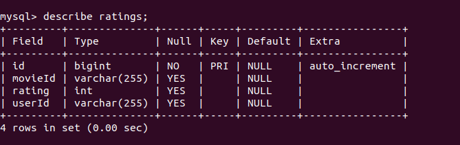
---


---

## B. Cache the MovieDB query results in MongoDB

### Step 1 - Set Up MongoDB Cache

#### 1.1 Verify MongoDB Installation
Ensure MongoDB (v8.x recommended) is running locally on the default port 27017.

```bash
mongod --version
sudo systemctl status mongod
```

#### 1.2 Design the Cache Document Structure
MongoDB is a document-oriented NoSQL database. Our movies collection stores JSON documents mapping to our Java objects.

```json
{
  "_id": "550",
  "name": "Fight Club",
  "description": "A ticking-time-bomb insomniac and a slippery soap salesman...",
  "_class": "com.example.movieinfoservice.models.Movie"
}
```

---

### Step 2 - Update pom.xml

Add the Spring Data MongoDB dependency to `movie-info-service/pom.xml`:

```xml
<dependency>
    <groupId>org.springframework.boot</groupId>
    <artifactId>spring-boot-starter-data-mongodb</artifactId>
</dependency>
```

---

### Step 3 - Configure application.properties

Open `movie-info-service/src/main/resources/application.properties`:

```properties
spring.data.mongodb.uri=mongodb://localhost:27017/movie_db
```

---

### Step 4 - Update Movie.java (MongoDB Document)

`movie-info-service/src/main/java/com/example/movieinfoservice/models/Movie.java`

```java
package com.example.movieinfoservice.models;

import org.springframework.data.annotation.Id;
import org.springframework.data.mongodb.core.mapping.Document;

@Document(collection = "movies")
public class Movie {

    @Id
    private String movieId;
    private String name;
    private String description;

    public Movie() {}

    public Movie(String movieId, String name, String description) {
        this.movieId = movieId;
        this.name = name;
        this.description = description;
    }
    
    // Getters and Setters...
}
```

---

### Step 5 - Create MovieRepository.java

`movie-info-service/src/main/java/com/example/movieinfoservice/models/MovieRepository.java`

```java
package com.example.movieinfoservice.models;

import org.springframework.data.mongodb.repository.MongoRepository;
import org.springframework.stereotype.Repository;

@Repository
public interface MovieRepository extends MongoRepository<Movie, String> {
}
```

---

### Step 6 - Implement Cache-Aside Logic in MovieResource.java

Modified the controller to implement the **Cache-Aside Pattern**.

```java
@Autowired
private MovieRepository movieRepository;

@RequestMapping("/{movieId}")
public Movie getMovieInfo(@PathVariable("movieId") String movieId) throws InterruptedException {
    
    // 1. Check MongoDB Cache first
    Optional<Movie> cachedMovie = movieRepository.findById(movieId);
    
    if (cachedMovie.isPresent()) {
        System.out.println("CACHE HIT: Returning movie " + movieId + " from MongoDB");
        return cachedMovie.get();
    }

    // 2. Cache Miss: Simulate slow external API delay
    System.out.println("CACHE MISS: Fetching movie " + movieId + " (2s delay)...");
    Thread.sleep(2000); 

    final String url = "https://api.themoviedb.org/3/movie/" + movieId + "?api_key=" + apiKey;
    MovieSummary movieSummary = restTemplate.getForObject(url, MovieSummary.class);
    
    Movie movie = new Movie(movieId, movieSummary.getTitle(), movieSummary.getOverview());

    // 3. Save to MongoDB for future requests
    movieRepository.save(movie);

    return movie;
}
```

---


### Step 7 - Testing

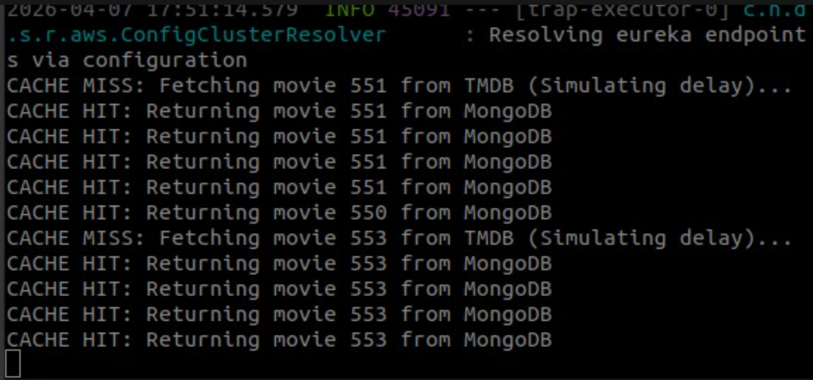

---

### Step 8 - Discussion Questions

* **Why suggest caching in this service?**
  Movie metadata is static. Caching reduces network latency and prevents redundant API calls.
* **Where else might caching matter?**
  Ideal for read-heavy data (configs, user profiles). Avoid for write-heavy data (live inventory) to prevent staleness.


## D. JMeter Performance vs Stress Testing
 
### Performance Test
 
**Thread Group** is used to represent the number of users concurrent at the same time.
 
**HTTP Request** represents the request each user will issue to the system, expecting a response.
- The request used is `GET localhost/movies/550`
- Each thread group can have multiple HTTP requests, but for this test one endpoint is sufficient since the goal is measuring concurrency load, not endpoint variety.
 
---
 
### Listeners
 
The listeners used on the system to measure the test performance and metrics are:
 
**1. View Results Tree**
Shows the requests queried themselves, with each request body and response body and important measures like load time, connection time, and latency. It also shows the successful and failed requests.
 
| Metric | Description |
|--------|-------------|
| Load time | Total time from sending request to receiving full response |
| Connect time | Time to establish TCP connection to server |
| Latency | Time from sending request to receiving FIRST byte of response |

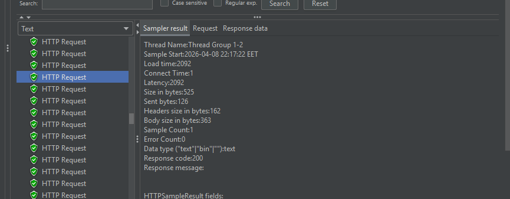
 
**2. Summary Report**
Report showing fast conclusions of the system performance.
 
**3. Aggregate Report**
Report showing system metrics like percentiles and throughput.
The most important metric is the **P90 (90% line)** which shows that 90% of users received their response within that time — more meaningful than average alone, since average is skewed by outliers.
 
---
 
### Thread Group Configurations
 
1. **Number of threads** — represents number of users actively accessing/connected to the system at the same time
 
2. **Ramp-up period** — represents the period of time all these users initiated their connection
   - Higher period → connections established in a longer period of time → less failure *(mimics organic real-world traffic growth)*
   - Lower period → representing the users accessing in exactly the same few seconds → more bottleneck → more chances of failure *(mimics a sudden spike – flash crowd scenario)*
 
3. **Loop count** — represents the number of requests each user issued back-to-back
 
4. **Final System Load:**
```
Total requests = Number of Threads × Loop Count
e.g. 10 threads × 10 loops = 100 total requests
```
 
---
 
### The Tests
### 1. Ratings Service

Aggregate Report

Label	# Samples	Average	Median	90% Line	95% Line	99% Line	Min	Max	Error %	Throughput	Received KB/sec	Sent KB/sec
HTTP Request	100	4	4	6	7	10	2	12	0.00%	11.05828	2.95	1.39
TOTAL	100	4	4	6	7	10	2	12	0.00%	11.05828	2.95	1.39

Summary Report

Label	# Samples	Average	Min	Max	Std. Dev.	Error %	Throughput	Received KB/sec	Sent KB/sec	Avg. Bytes
HTTP Request	100	4	2	12	1.57	0.00%	11.05828	2.95	1.39	273
TOTAL	100	4	2	12	1.57	0.00%	11.05828	2.95	1.39	273


### 2. Movies Service

 
> Configuration order: **(Number of threads, Ramp-up period, Loop count)**
 
---
 
#### Non-Cached Test `(10, 10, 10)`
 
**Summary Report:**
 
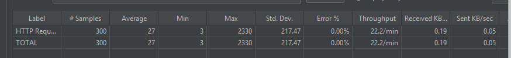
 
**Aggregate Report:**
 
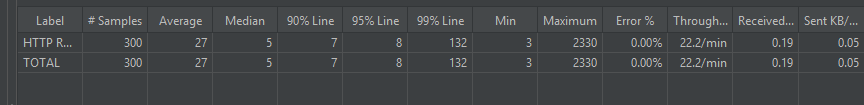
 
---
 
The difference between a cached response and a non-cached response should be tested.
 
In the non-cached response, the first loop (first 10 requests, one per thread) all experienced cache misses simultaneously because all threads checked MongoDB at the same time, before any result was cached. This caused a higher latency and, in turn, increased the average response of the system, which caused the P99 percentile to be relatively higher.
 
However, in the cached response, the average is much lower due to all responses succeeding with a cache hit.
 
---
 
#### Cached Test `(10, 10, 10)`
 
**Cached Summary Report:**
 
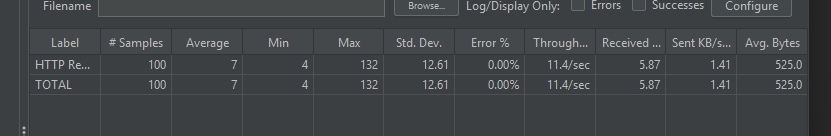
 
**Cached Aggregate Report:**
 
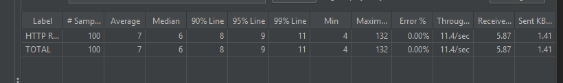
 
---


### 3.Trending Service

 
### Stress Test


### 1. Ratings Service

#### Configuration 1: `(1000, 10, 100)`

Aggregate Report

Label	# Samples	Average	Median	90% Line	95% Line	99% Line	Min	Max	Error %	Throughput	Received KB/sec	Sent KB/sec
Movies HTTP Request	100000	662	614	1184	1437	2068	1	2350	0.00%	1246.61855	332.31	157.04
TOTAL	100000	662	614	1184	1437	2068	1	2350	0.00%	1246.61855	332.31	157.04

Summary Report

Label	# Samples	Average	Min	Max	Std. Dev.	Error %	Throughput	Received KB/sec	Sent KB/sec	Avg. Bytes
Movies HTTP Request	100000	662	1	2350	399.45	0.00%	1246.61855	332.31	157.04	273
TOTAL	100000	662	1	2350	399.45	0.00%	1246.61855	332.31	157.04	273


#### Configuration 2: `(3000, 10, 100)` Breaking Point

Aggregate Report

Label	# Samples	Average	Median	90% Line	95% Line	99% Line	Min	Max	Error %	Throughput	Received KB/sec	Sent KB/sec
Movies HTTP Request	283659	1654	1629	1991	2095	3812	1	8718	0.00%	1644.80047	438.51	207.21
TOTAL	283659	1654	1629	1991	2095	3812	1	8718	0.00%	1644.80047	438.51	207.21


Summary Report

Label	# Samples	Average	Min	Max	Std. Dev.	Error %	Throughput	Received KB/sec	Sent KB/sec	Avg. Bytes
Movies HTTP Request	300000	1569	1	8718	773.62	5.45%	1739.55398	681.87	207.21	401.4
TOTAL	300000	1569	1	8718	773.62	5.45%	1739.55398	681.87	207.21	401.4

Note:
Error was found, with small percentage, but it showed the start of the breaking point


### 2. Movies Service

 
To evaluate the stress/breaking point of the system, multiple configuration variations were used.
 
---
 
#### Configuration 1: `(100, 10, 50)`
 
**Aggregate Report:**
 
| Label | # Samples | Average | Median | 90% Line | 95% Line | 99% Line | Min | Max | Error % | Throughput | Received KB/sec | Sent KB/sec |
|-------|-----------|---------|--------|----------|----------|----------|-----|-----|---------|------------|-----------------|-------------|
| Movies HTTP Request | 10000 | 5 | 3 | 9 | 20 | 43 | 1 | 658 | 0.00% | 255.6564 | 131.07 | 31.46 |
| TOTAL | 10000 | 5 | 3 | 9 | 20 | 43 | 1 | 658 | 0.00% | 255.6564 | 131.07 | 31.46 |
 
**Summary Report:**

| Label | # Samples | Average | Min | Max | Std. Dev. | Error % | Throughput | Received KB/sec | Sent KB/sec | Avg. Bytes |
|-------|-----------|---------|-----|-----|-----------|---------|------------|-----------------|-------------|------------|
| Movies HTTP Request | 10000 | 5 | 1 | 658 | 20.75 | 0.00% | 255.6564 | 131.07 | 31.46 | 525 |
| TOTAL | 10000 | 5 | 1 | 658 | 20.75 | 0.00% | 255.6564 | 131.07 | 31.46 | 525 |
 
---

#### Configuration 2: `(1000, 5, 100)`

**Aggregate Report:**

| Label | # Samples | Average | Median | 90% Line | 95% Line | 99% Line | Min | Max | Error % | Throughput | Received KB/sec | Sent KB/sec |
|-------|-----------|---------|--------|----------|----------|----------|-----|-----|---------|------------|-----------------|-------------|
| Movies HTTP Request | 135000 | 1216 | 338 | 652 | 812 | 37056 | 1 | 88338 | 0.00% | 348.98871 | 178.92 | 42.94 |
| TOTAL | 135000 | 1216 | 338 | 652 | 812 | 37056 | 1 | 88338 | 0.00% | 348.98871 | 178.92 | 42.94 |

**Summary Report:**

| Label | # Samples | Average | Min | Max | Std. Dev. | Error % | Throughput | Received KB/sec | Sent KB/sec | Avg. Bytes |
|-------|-----------|---------|-----|-----|-----------|---------|------------|-----------------|-------------|------------|
| Movies HTTP Request | 135000 | 1216 | 1 | 88338 | 7610.22 | 0.00% | 348.98871 | 178.92 | 42.94 | 525 |
| TOTAL | 135000 | 1216 | 1 | 88338 | 7610.22 | 0.00% | 348.98871 | 178.92 | 42.94 | 525 |

---

#### Configuration 3: `(3000, 10, 100)`

**Aggregate Report:**

| Label | # Samples | Average | Median | 90% Line | 95% Line | 99% Line | Min | Max | Error % | Throughput | Received KB/sec | Sent KB/sec |
|-------|-----------|---------|--------|----------|----------|----------|-----|-----|---------|------------|-----------------|-------------|
| Movies HTTP Request | 300000 | 1405 | 1345 | 2078 | 2375 | 2789 | 1 | 3448 | 0.00% | 1963.78775 | 1006.82 | 241.64 |
| TOTAL | 300000 | 1405 | 1345 | 2078 | 2375 | 2789 | 1 | 3448 | 0.00% | 1963.78775 | 1006.82 | 241.64 |

**Summary Report:**

| Label | # Samples | Average | Min | Max | Std. Dev. | Error % | Throughput | Received KB/sec | Sent KB/sec | Avg. Bytes |
|-------|-----------|---------|-----|-----|-----------|---------|------------|-----------------|-------------|------------|
| Movies HTTP Request | 300000 | 1405 | 1 | 3448 | 496.3 | 0.00% | 1963.78775 | 1006.82 | 241.64 | 525 |
| TOTAL | 300000 | 1405 | 1 | 3448 | 496.3 | 0.00% | 1963.78775 | 1006.82 | 241.64 | 525 |

> **Note:** Throughput jumped is higher compared to configuration 2, 
> while standard deviation is lower, indicating much more 
> consistent response times due to the longer ramp-up period (10s) allowed the system to 
> warm up more gracefully - initate connections in a longer period of time.

---

#### Configuration 4: `(5000, 3, 100)` — Breaking Point 

**Aggregate Report:**

| Label | # Samples | Average | Median | 90% Line | 95% Line | 99% Line | Min | Max | Error % | Throughput | Received KB/sec | Sent KB/sec |
|-------|-----------|---------|--------|----------|----------|----------|-----|-----|---------|------------|-----------------|-------------|
| Movies HTTP Request | 635000 | 2874 | 3063 | 5031 | 5880 | 10017 | 0 | 88338 | 8.97% | 720.03792 | 501.97 | 80.65 |
| TOTAL | 635000 | 2874 | 3063 | 5031 | 5880 | 10017 | 0 | 88338 | 8.97% | 720.03792 | 501.97 | 80.65 |

**Summary Report:**

| Label | # Samples | Average | Min | Max | Std. Dev. | Error % | Throughput | Received KB/sec | Sent KB/sec | Avg. Bytes |
|-------|-----------|---------|-----|-----|-----------|---------|------------|-----------------|-------------|------------|
| Movies HTTP Request | 635000 | 2874 | 0 | 88338 | 4017.18 | 8.97% | 720.03792 | 501.97 | 80.65 | 713.9 |
| TOTAL | 635000 | 2874 | 0 | 88338 | 4017.18 | 8.97% | 720.03792 | 501.97 | 80.65 | 713.9 |

---

### Stress Test Observations

latency became higher even with caching active,
as seen in the request tree:

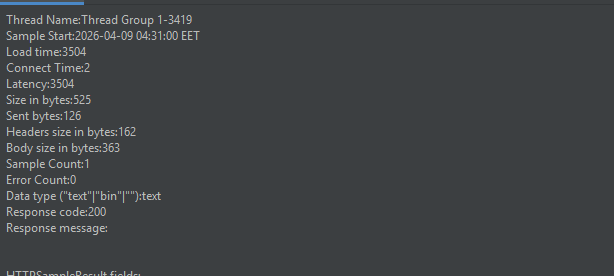

After testing multiple configurations, the system reached its breaking point where errors 
occurred due to the inability to establish new connections. This was captured in the 
following error:


>apache.http.conn.HttpHostConnectException: Connect to localhost:8082 [localhost/127.0.0.1, localhost/0:0:0:0:0:0:0:1] failed: Connection refused: connect at org.apache.http.impl.conn.DefaultHttpClientConnectionOperator.connect(DefaultHttpClientConnectionOperator.java:156) at org.apache.jmeter.protocol.http.sampler.HTTPHC4Impl$JMeterDefaultHttpClientConnectionOperator.connect(HTTPHC4Impl.java:409) at org.apache.http.impl.conn.PoolingHttpClientConnectionManager.connect(PoolingHttpClientConnectionManager.java:376) at org.apache.http.impl.execchain.MainClientExec.establishRoute(MainClientExec.java:393)

This means connection has failed due to inability of OS to establish more TCP connection , it was temporary but it showed the system bottleneck problem.


### Conclusion

- Caching significantly reduced per-request processing time, which delayed the breaking
  point compared to a non-cached system — but did not eliminate it, since the bottleneck
  shifted from response latency to connection handling capacity


### 3.Trending Service


#### Configuration 1: `(1000, 10, 100)`

Aggregate Report

Label	# Samples	Average	Median	90% Line	95% Line	99% Line	Min	Max	Error %	Throughput	Received KB/sec	Sent KB/sec
Movies HTTP Request	99997	1515	1383	2020	2296	8219	5	10008	0.00%	601.11691	179.63	77.49
TOTAL	99997	1515	1383	2020	2296	8219	5	10008	0.00%	601.11691	179.63	77.49


Summary Report

Label	# Samples	Average	Min	Max	Std. Dev.	Error %	Throughput	Received KB/sec	Sent KB/sec	Avg. Bytes
Movies HTTP Request	100000	1515	5	10008	1189.11	0.00%	601.13494	179.64	77.49	306
TOTAL	100000	1515	5	10008	1189.11	0.00%	601.13494	179.64	77.49	306


#### Configuration 2: `(2000, 10, 100)` Breaking Point

Aggregate Report

Label	# Samples	Average	Median	90% Line	95% Line	99% Line	Min	Max	Error %	Throughput	Received KB/sec	Sent KB/sec
Movies HTTP Request	199941	3103	3127	4086	4373	5019	5	6139	0.00%	603.20214	180.25	77.76
TOTAL	199941	3103	3127	4086	4373	5019	5	6139	0.00%	603.20214	180.25	77.76


Summary Report

Label	# Samples	Average	Min	Max	Std. Dev.	Error %	Throughput	Received KB/sec	Sent KB/sec	Avg. Bytes
Movies HTTP Request	200000	3102	5	6139	874.16	0.03%	603.38014	180.3	77.78	306
TOTAL	200000	3102	5	6139	874.16	0.03%	603.38014	180.3	77.78	306


> eventhough , error is very low, it was due to a TCP connection failure, which means the bottleneck problem started, hence The Breaking Point

#### Configuration 3: `(3000, 10, 100)`

Aggregate Report

Label	# Samples	Average	Median	90% Line	95% Line	99% Line	Min	Max	Error %	Throughput	Received KB/sec	Sent KB/sec
Movies HTTP Request	162786	5264	4481	8690	11136	19824	5	54212	0.00%	421.25175	125.88	54.3
TOTAL	162786	5264	4481	8690	11136	19824	5	54212	0.00%	421.25175	125.88	54.3

Summary Report

Label	# Samples	Average	Min	Max	Std. Dev.	Error %	Throughput	Received KB/sec	Sent KB/sec	Avg. Bytes
Movies HTTP Request	300000	3317	1	54212	3538.25	45.74%	776.3292	965.84	55.86	1274
TOTAL	300000	3317	1	54212	3538.25	45.74%	776.3292	965.84	55.86	1274


## Conclusion , Trending Service Breaking point is in the middle between these 2 extreme cases

### note

to generate a full visual report command used was 

```bash
jmeter -n -t "Stress Test\Stress-Test2.jmx" -l StressResults2.jtl -e -o report_folder\StressTest2
```

where

- -n          → run without GUI
- -t          → your test plan file
- -l          → save raw results to this file
- -e          → generate report
- -o          → output folder for HTML report


## Performance Charts
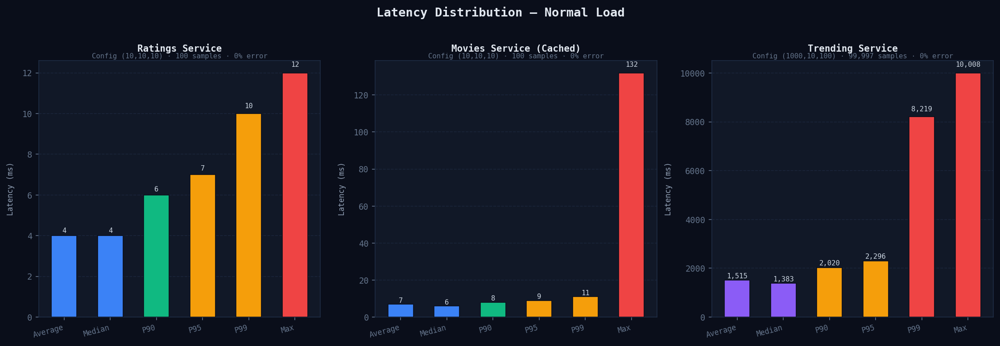 
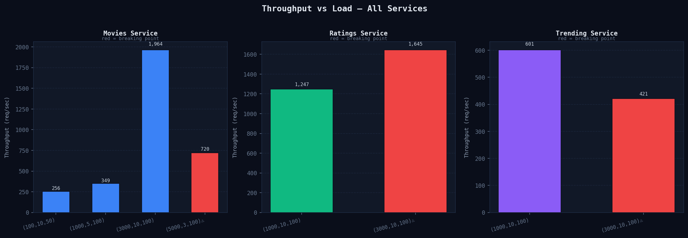 
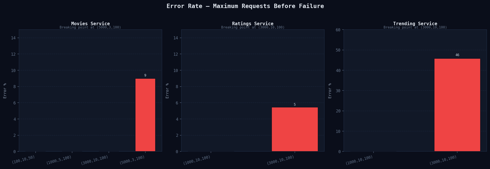
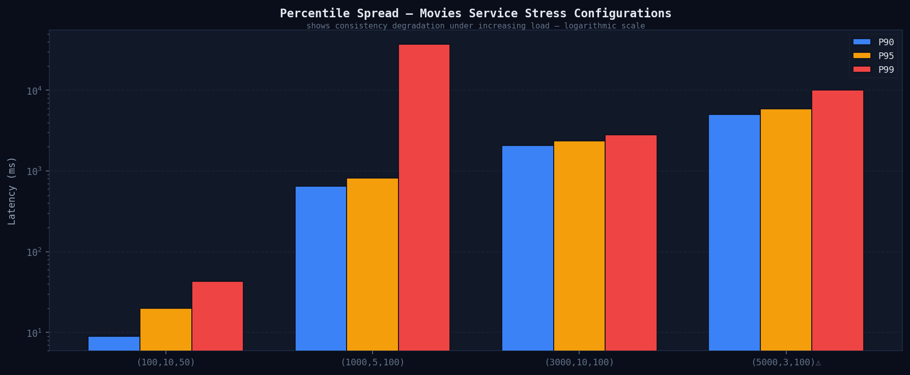
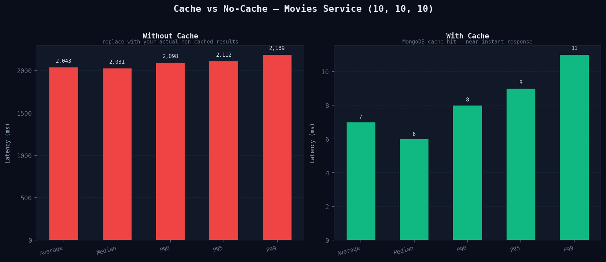